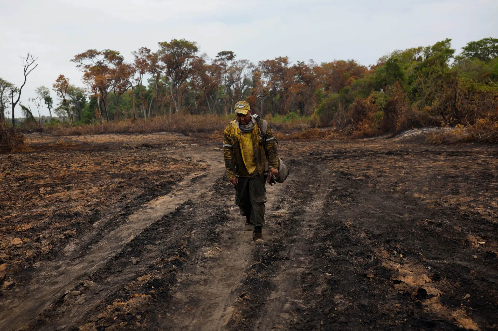
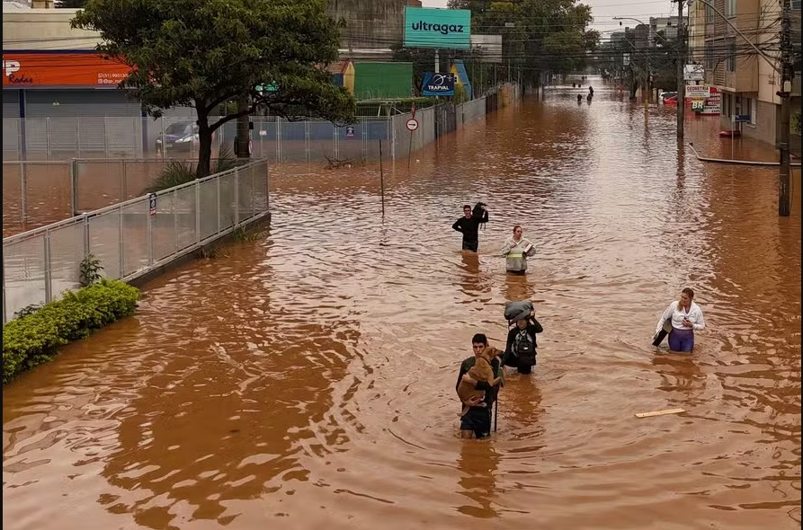

# V.A.R (Vigilância-Ambiental-Resiliente) - Analise e Visão Computacional

Mudanças climaticas vem se tornando algo recorrente no mundo, e precisamos nos previnir.
O VAR é um projeto que foi idealizado para ajudar pessoas em areas de risco e previnir desastres naturais. O projeto constitui-se principalmente usar redes neurais em um dataset treinado aplicadas a visão computacional para fazer detecção do ambiente e chamar autoridades em riscos de desastres naturais

##  Sobre o projeto📚:
Esse projeto teve melhorias adaptadas para receber a analise de imagens e vídeos pela API de AI generativa do google, onde passará primeiramente por visões computacionais que trarão a detecção e previsão de pessoas em areas e a analise do gemini, trazendo detecção de pessoas ou animais perdidas e em areas de risco, além de trazer ações preventivas a serem tomadas para resgate

 

## Tecnologia/Biblioteca 💻
- **Python** utilizado no google colab
- **Ultralytcs YOLO** Versão YOLO v8
- **Gemini API**

## Suporte 👇
- Os arquivos **yolov8m.pt** e **yolov8n.pt** são os similares, a diferença é que o **v8m** é a versão intermediaria, sendo mais robusto, porém com mais tempo de execução e o **v8n** é uma versão mais leve de todas, sendo mais rápida, porém menos precisa
  
- Arquivos de imagens e vídeos estarão dentro da pasta assets caso queira adiciona-las no google colab

## Como Utilizar dentro do google colab🧩:

**Passo a passo**
### 1. Adicione o arquivo **YOLOv8m** ou **YOLOv8x** para rodar o modelo de detecção de pessoas
Lembre de passar o caminho do arquivo correto para onde adicionará esse arquivo
     
   ```bash
       model.predict(source="<CAMINHO_ARQUIVO_AQUI>", conf=0.7, save=True, show=True)
       model = YOLO("/content/yolov8n.pt")
     
       model.predict(source="<CAMINHO_ARQUIVO_AQUI>", conf=0.7, save=True, show=True)
       model.predict(source="/content/areas-de-risco.jpeg", conf=0.7, save=True, show=True)  
   ``` 
### 2. Coloque sua GOOGLE_API_KEY
  ```bash
 from google.colab import userdata
GOOGLE_API_KEY=userdata.get('GOOGLE_API_KEY')
genai.configure(api_key=GOOGLE_API_KEY)
  ``` 
### 3. Após fazer isso, o proximo codigo do google colab será o "Extração de frames do arquivo"
Na variavel video_file_name defina o caminho do arquivo que quer detectar e analisar com gemini, você pode escolher 
algum arquivo local ou hospetado, como:
**Vídeo Hospodade**
  ```bash
    video_file_name = "[.mp4](https://exemplo.com/images/teste.mp4)"
  ```
ou **Vídeo local da sua máquina**
```bash
    video_file_name = "/content/runs/detect/predict/RS_video.mp4"
  ```
